# [Anonforce TryHackMe Writeup/Walkthrough][1]
boot2root machine for FIT and bsides guatemala CTF

#### Scan the machine.
> If you are unsure how to tackle this, I recommend checking out the [Nmap Tutorials by Hack Hunt][2].

`nmap -sV -Pn <IP>`

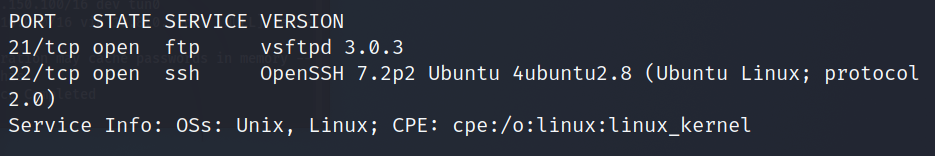

Looks like we have two ports open: `21, 22`.

Let's try to connect via `ftp` using `anonymous:anonymous` as credentials.

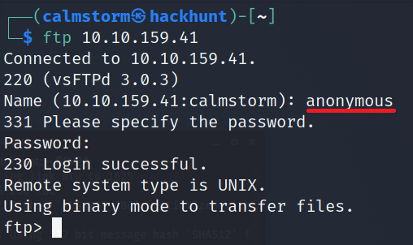

I looked around and found `user.txt` in the home directory of **melodias**.

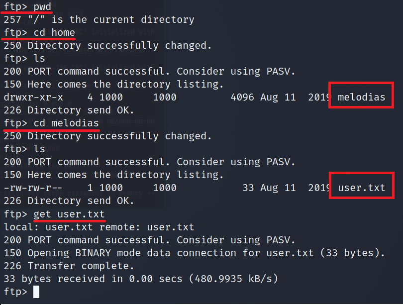
> We have username `melodias` which maybe handy later.

I found an ordinary folder in the root directory, `notread`. Umm, we gonna :stuck_out_tongue_closed_eyes:

Found two files, let's get the files in our local machine and decrypt it.

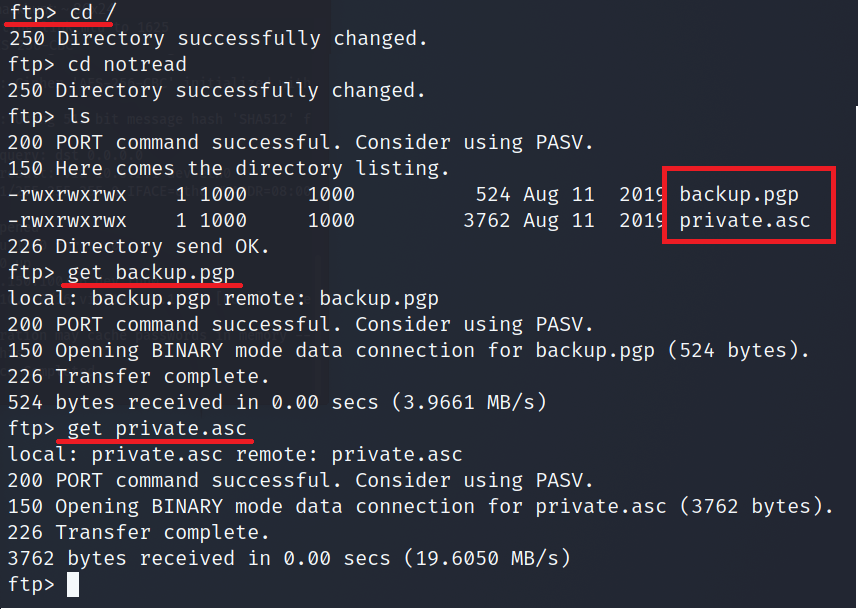
> Now that we have the files. Disconnect `ftp`.

Try importing the key `private.asc`.

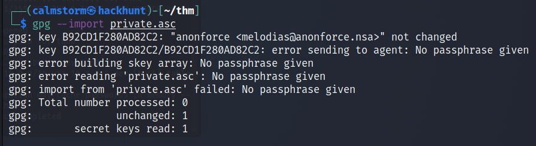
> It seems like we need passpharse to import the key.

We can crack this using `JohnTheRipper`. Before start cracking we need to convert the file into `John` format using `gpg2john`. CMD -> `gpg2john private.asc > privateJohn`

Start cracking with command - `john --wordlist=rockyou.txt privateJohn`

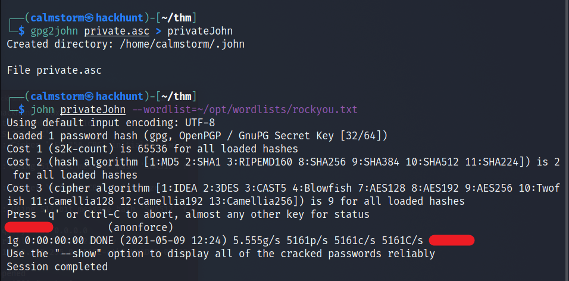
> Now that we have the password we can import the key.

To import the key - `gpg --import private.asc`. When asked for the password, enter the password you got from the previous result.

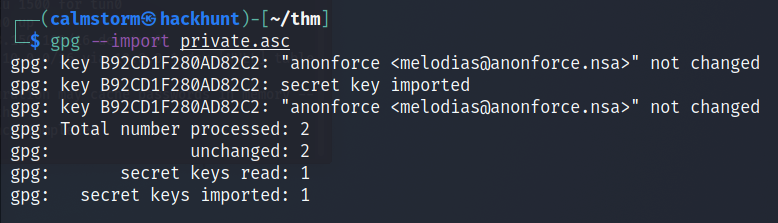
> The key is imported. We can try to decrypt the *backup.pgp* file.

To decrypt the file - `gpg backup.pgp`. When asked for the password, enter the password you got from John.

Once done, let's check the content of the file.

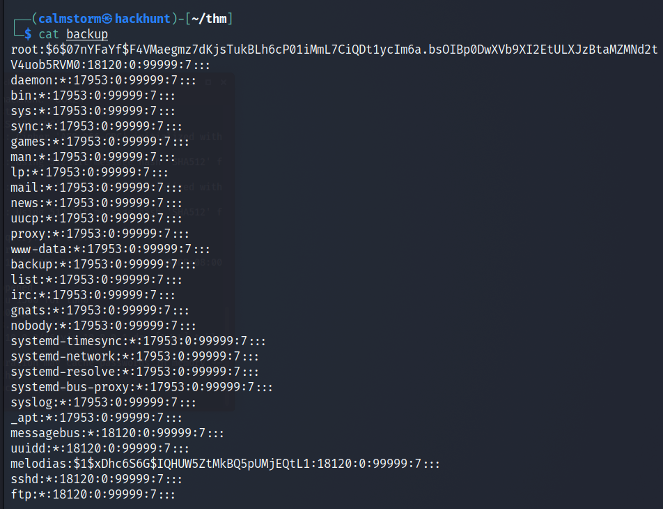
> Seems like a backup for `passwd` file.

Interestingly, we have the password for the `root`. But it is encrypted. Let's copy the password for decryption.

COMMAND -> `cat backup | grep root > root_psswd.txt`

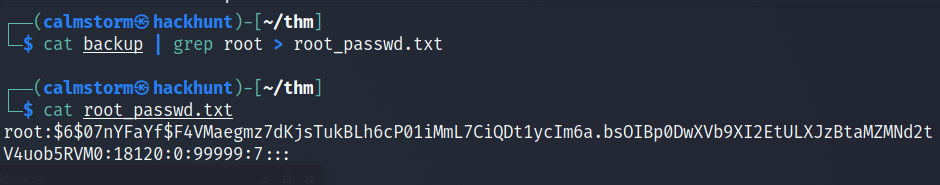
> We have the hash in a file. So we can use `hashcat` to decrypt the password.

To run hashcat, we need to know the type of encryption. In this case `$6$` means SHA256/Unix. In `hashcat`, it is denoted as **1800**.

To know more about [hashcat][3], read this!

Command to decrypt is `hashcat -m 1800 --force root_passwd.txt --wordlist rockyou.txt`

Alternatively, you can use `John` with command - `john root_passwd.txt --wordlist=rockyou.txt`

Now that we have the password, we can `ssh` as `root` and get the root flag.

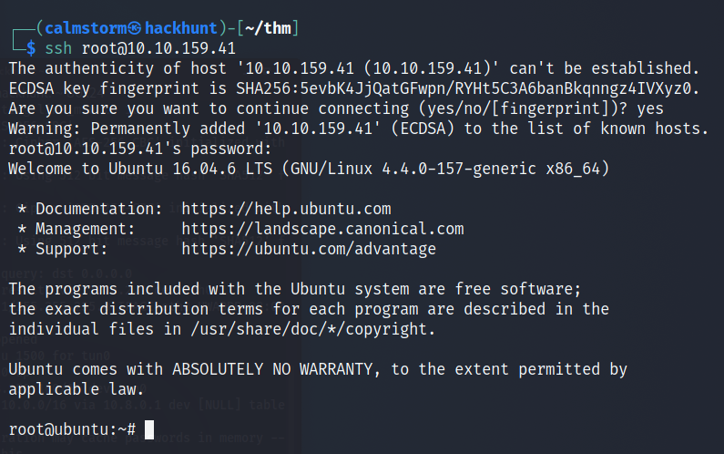
> BAAM! We have the access.

You know what to do next :stuck_out_tongue_winking_eye:

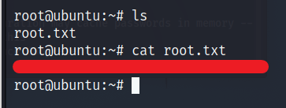

[1]: https://tryhackme.com/room/bsidesgtanonforce
[2]: https://blog.hackhunt.in/search/label/Nmap
[3]: https://hashcat.net/wiki/doku.php?id=hashcat
