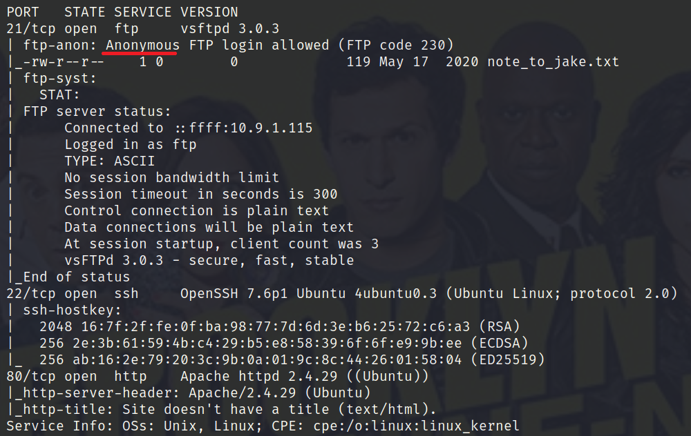
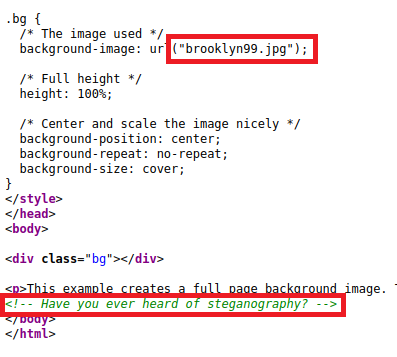
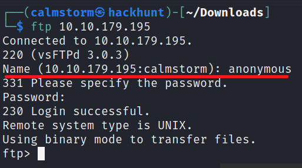
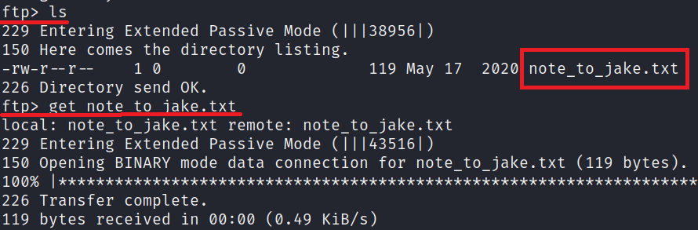
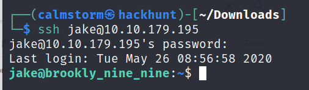
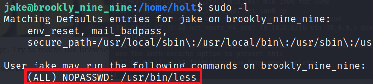

# [Brooklyn Nine Nine][1]

This room is aimed for beginner level hackers but anyone can try to hack this box. There are two main intended ways to root the box.

#### Scan the machine.
> If you are unsure how to tackle this, I recommend checking out the [Nmap Tutorials by Hack Hunt][2].

`nmap -sV -Pn <IP>`



Looks like we have three ports open: `21, 22, 80`.

Web server is running on `port 80`. Found nothing on the website, but in the source code there is a comment about steganography.



> Downloaded the image (URL: http://<IP>/brooklyn99.jpg) and tried `binwalk` and `steghide`. Found nothing much, so moving on!

FTP Anonymous login is enabled, let's login. CMD - `ftp <IP>`

```
Username: anonymous
password: (just hit enter)
```



Found a file, `note_to_jake.txt`. Download the file to see the content.



> File can be downloaded using the `get` command.

Content of the file:
```
From Amy,

Jake please change your password. It is too weak and holt will be mad if someone hacks into the nine nine
```

> Seems like Jake's password is weak.

We have SSH port open, bruteforcing Jake's Password using `Hydra`.

CMD - `hydra -l jake -P rockyou.txt -t 4 -f`
> Wait for a while and you will get the password.

Try logging in with the password via `ssh`. CMD - `ssh jake@<IP>`.


> Baam! We have the access. Oh jake, what have you done :stuck_out_tongue_closed_eyes:

After looking around a bit, found `user.txt` in holt's home directory. Location - `home/holt`.

```
cd ..
cd holt
cat user.txt
```
> This will give you the user flag! Oh jake, surely Captain Holt will be upset with you. :worried:

There is one more file but didn't have access to read that file. Let's run `sudo -l` command to know what kind of commands we can run as sudo.


> Looks like we can run `less` with sudo.

Check [GTFOBins][3], for exploit via `less`.
> It say's with this command we can read any file if executed as `sudo`.

So, we can directly run `sudo less /root/root.txt`.
> This command will give you the root flag.

[1]: https://tryhackme.com/room/brooklynninenine
[2]: https://blog.hackhunt.in/search/label/Nmap
[3]: https://gtfobins.github.io/gtfobins/less/
